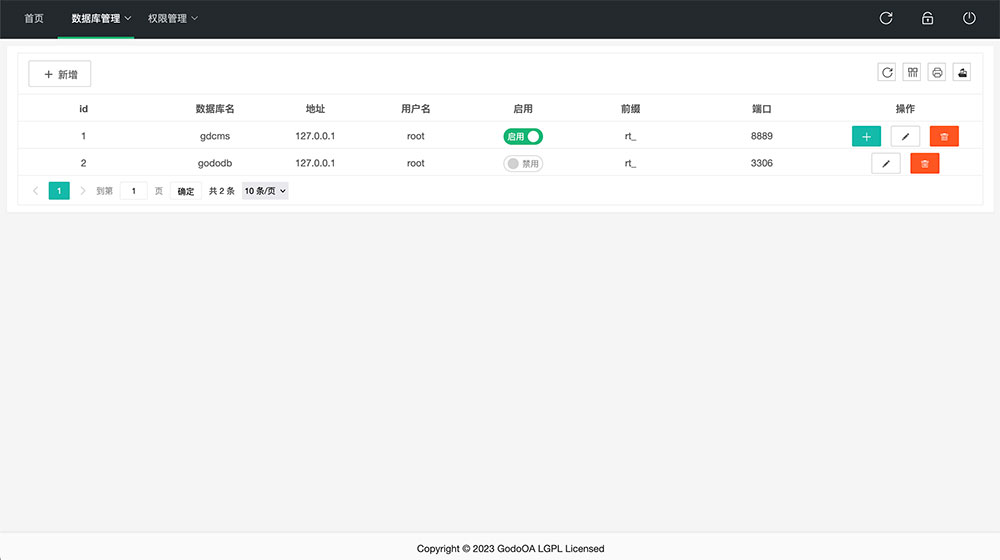

# godoDb

## 更新日志
### 2024-07-10
- 添加未连接mysql也能登陆
- 去除electron包

## 特点
godoDb数据库设计器，是一款mysql数据库管理工具。

- 支持数据库备份还原，支持添加数据库；
- 支持自动生成数据库设计文档，md 格式以及实时预览，可以下载成 pdf/word文件；
- 支持数据表名/注释/autoid 的更改，支持优化表/修复表/删除表/清空表；
- 可查看/编辑/新增/复制任意表数据；
- 可执行sql文件，并查看执行后的数据结果；
- 可更改字段名/注释/默认值/排序，可拖拽排序字段，可删除字段；
- 支持连接/管理多个外部数据库，可通过ssh连接外部数据库，可导入pem文件连接；
- 支持数据库表保护；
- 精细化的权限控制，多角色多用户管理；
- 可查询每个用户的操作记录，方便回查；

## 项目地址
[gitee](https://gitee.com/ruitao_admin/gododb)

[github](https://github.com/phpk/gododb)

## 安装
- 如未安装pnpm，需事先安装pnpm
```
npm i pnpm -g

```
- 安装依赖
```
pnpm i

```
- 导入data/gododb.sql数据库文件，并修改src/config/adapter.js数据库配置信息

## 启动服务

```
npm start
```

## 正式环境部署

```
pm2 start pm2.json
# pm2 reload pm2.json //reload
```
- 账号：admin
- 密码：admin 

## 演示图片





## 微信群


## 开源

- 承诺永久免费开源
- 允许企业/个人单独使用
- 如用于商业活动或二次开发后发售，请购买相关版权
- 不提供私下维护工作，如有bug请 [issures](https://gitee.com/ruitao_admin/gododbs) 提交
- 请尊重作者的劳动成果
